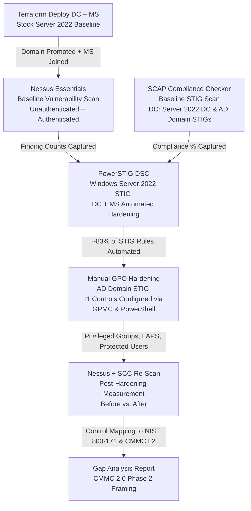

# Azure Risk Management & DISA STIG Hardening Lab

> This project is a cloud-based risk management and compliance home lab built from scratch in Microsoft Azure. It simulates the full execution of the NIST Risk Management Framework (RMF), from preparation through continuous monitoring, on a small Active Directory environment hosted in Azure. Initial misconfigurations and vulnerabilities were identified using Nessus, hardening was implemented with PowerShell scripts, and a reassessment was performed to verify that the security improvements strengthened the overall security posture. The implemented security controls align directly with the industry-standard NIST SP 800-171 and CMMC 2.0 Level 2 control requirements.

---

### Ethical and Legal Disclaimer
> [!IMPORTANT]
> All scanning, hardening, and configuration activity in this project was conducted exclusively against infrastructure I own and control in a private Azure lab environment. All tools were used in accordance with their terms of service and applicable laws. This writeup is for educational purposes only.

## Table of Contents

- [Motivation](#motivation)
- [Environment](#environment)
- [Infrastructure & Automation](#infrastructure--automation)
- [Toolset](#toolset)
- [Methodology](#methodology)
- [NIST RMF Alignment](#nist-rmf-alignment)
- [Key Findings](#key-findings)
- [AD Domain STIG — Manual GPO Hardening](#ad-domain-stig--manual-gpo-hardening)
- [Control Mapping](#control-mapping)
- [Skills Gained](#skills-gained)
- [Screenshots](#screenshots)

---

## Motivation

I wanted to gain hands-on experience implementing the NIST RMF and the vulnerability management lifecycle within a realistic IT environment. By following the NIST RMF and implementing NIST SP 800-171 controls alongside DISA STIGs, I would be able to demonstrate practical expertise in foundational Governance, Risk, and Compliance (GRC) concepts. To accomplish this goal, I built the network from scratch in Microsoft Azure using Terraform, deployed a realistic Active Directory domain, and used the same toolchain that DoD assessors and commercial vulnerability management programs rely on to measure and enforce compliance.

---

## Environment

| Component | Details |
|---|---|
| **Cloud** | Microsoft Azure |
| **IaC** | Terraform via AzureRM Provider |
| **Domain Controller (DC)** | Windows Server 2022 Datacenter |
| **Member Server (MS)** | Windows Server 2022 Datacenter |
| **AD Domain** | lab.local |
| **Network** | Azure VNet with one subnet, NSG with only intranet traffic allowed |
| **Access** | RDP scoped to local, fixed IP |
| **Vulnerability Scanner** | Tenable Nessus Essentials 10.x |
| **Compliance Scanner** | SCAP Compliance Checker (SCC) 5.14.x |

---

## Infrastructure & Automation

All infrastructure was provisioned using Terraform. Terraform scripts create the resource group, virtual network, subnet, NSG, public IPs, NICs, and both Windows Server 2022 VMs. States are managed with `tfstate` files and all infrastructure is torn down once the exercises are completed. Cloud costs are managed by deallocating unused resources between sessions. Deploying this lab in Terraform allows for the infrastructure to be consistent and repeatable across multiple uses.

Key design decisions:

- **NSG Three-Rule Policy** - The NSG rules allow inbound access from all ports on the local PC, all intranet traffic between the two VMs, and exclude everything else. These rules ensure that the lab is properly isolated from the internet, but necessary communication is still facilitated between the machines.
- **On-demand Spin-Up** - The lab can be activated whenever exercises are being conducted with a single Terraform command. Costs are only incurred when the lab is activated and they cease once the lab is deallocated.

---

## Toolset

| Tool | Category | Purpose |
|---|---|---|
| **Terraform** | Infrastructure as Code | Declarative provisioning of all Azure resources |
| **Active Directory Domain Services** | Target Environment | Realistic enterprise topology with a DC, OU structure, and tiered accounts |
| **Tenable Nessus Essentials** | Vulnerability Scanner | Unauthenticated and credentialed network scanning for CVE findings |
| **SCAP Compliance Checker (SCC)** | Compliance Scanner | DISA STIG benchmark scanner that produces HTML reports |
| **PowerSTIG** | Automated Hardening | PowerShell Desired State Configuration resource for automating STIG application to Windows Server 2022 |
| **Azure CLI** | Lab Operations | VM lifecycle management and NSG Rule Management |

---

## Methodology

The lab runs in four sequential phases:

**Phase 1 - Infrastructure & Domain Stand-Up** provisions the entire environment with a single Terraform deployment. Both virtual machines are deployed from stock Windows Server 2022 Datacenter images without additional configuration, providing a realistic baseline from which to begin the risk management exercise. The first server is promoted to a domain controller for the `lab.local` domain, and a realistic organizational unit (OU) structure is created with sample data. The second server is joined to the domain to complete a small but realistic enterprise network. No security hardening is applied during this phase.

**Phase 2 - Baseline Scanning** measures the pre-hardening security posture using two complementary tools. Nessus Essentials performs both unauthenticated and authenticated network scans against both virtual machines to identify CVE-level vulnerabilities and exposed services. SCAP Compliance Checker (SCC) runs the Windows Server 2022 DC, Microsoft STIG, and Active Directory Domain STIG benchmarks against the domain controller to establish a baseline compliance score. The same SCC scan is then performed on the second, domain-joined server to produce a comparable baseline compliance score. Windows Firewall is temporarily disabled on both virtual machines during scanning to ensure an accurate baseline assessment.

**Phase 3 - Hardening** applies the DISA STIG controls in two layers. First, PowerSTIG's `WindowsServer` DSC composite resource automates operating system-level registry, audit policy, security policy, and service configuration changes. Second, the technically configurable controls from the Active Directory Domain STIG are implemented manually through Group Policy, Active Directory Users and Computers (ADUC), and PowerShell. During the second manual configuration process, privileged group memberships are restricted, Windows LAPS is enabled to randomize local administrator passwords, Protected Users is configured to reduce opportunities for lateral movement, delegation auditing is enabled to improve logging, and internet access is restricted to further secure the environment.

**Phase 4 - Post-Hardening Scanning & Analysis** repeats the Nessus and SCC scans using the same configuration as the baseline assessment. Comparing the pre- and post-hardening results demonstrates how implementing the DISA STIG controls reduced the network's attack surface, remediated critical vulnerabilities, and improved overall security compliance.

## Methodology Flowchart

---

## NIST RMF Alignment

NIST SP 800-37 defines the Risk Management Framework (RMF) as a seven-step lifecycle for managing security and privacy risk across an information system. This seven-step lifecycle served as the primary inspiration for the lab and structured the methodology carried out. The table below traces each step to what was done in the lab.

| RMF Step | What it requires | How this lab executes it |
|---|---|---|
| **1 - Prepare** | Establish context, define roles, identify risk tolerance, and document the system boundary before assessment begins | Defined system boundary (two VMs, one AD domain), scoped the assessment to OS and domain-level controls, selected toolchain and control baseline (DISA STIGs → NIST 800-53 → NIST 800-171), and documented constraints before any scanning began |
| **2 - Categorize** | Classify the system and its information based on a formal impact analysis (FIPS 199 / NIST SP 800-60) | Classified the lab environment as a general-purpose Windows infrastructure system processing no classified or CUI data. This is equivalent to a Moderate confidentiality / Low integrity / Low availability baseline for exercise purposes. The DISA STIG selection reflects this categorization since STIGs are calibrated to DoD Moderate baselines |
| **3 - Select** | Choose an appropriate set of baseline security controls (typically from NIST SP 800-53) and tailor them to the system | Selected the DISA Windows Server 2022 STIG (V2.8) and Active Directory Domain STIG (V3R7) as the control baseline. Both are directly derived from NIST SP 800-53 and map to NIST 800-171 / CMMC 2.0 Level 2 requirements. PowerSTIG organizational settings represent the tailoring step |
| **4 - Implement** | Deploy the selected controls and document exactly how they are put in place | PowerSTIG DSC applied the OS-level STIG baseline to both the DC and MS. Eleven AD Domain STIG controls were manually implemented via GPMC and PowerShell, and each implementation is documented with the STIG rule ID, the tool used, and the resulting configuration |
| **5 - Assess** | Determine whether controls are in place, implemented correctly, and producing the desired outcome | Nessus Essentials (unauthenticated & authenticated) measured the vulnerability surface before and after hardening. SCC ran the full SCAP benchmark against both VMs pre- and post-hardening to produce scored compliance results, and both tools were run under identical settings for a valid before/after comparison |
| **6 - Authorize** | A senior official reviews the assessed risk picture and makes a formal risk-based decision (ATO) | Represented in the project by the before/after scan comparison and the control mapping table (provided below). These artifacts reflect how a real authorizing official would review to determine whether residual risk is acceptable |
| **7 - Monitor** | Continuously track control effectiveness, system changes, and evolving risks on an ongoing basis | Unresolved findings are documented with remediation paths to track controls effectiveness, the on-demand deallocation model ensures predictable cost management, and the SCC re-scan capability can re-map the system compliance state at any point in the future |

---

## Key Findings

### Nessus - Vulnerability Count (Before vs. After)

Nessus scans were run in unauthenticated and authenticated modes against both hosts. Authenticated scans surface patch-level and local-configuration findings invisible to network-only probes.

| Host | Mode | Pre-Hardening Findings | Post-Hardening Findings | Result |
|---|---|---|---|---|
| DC | Unauthenticated | 24 | 18 | -6 (↓ 25%) |
| DC | Authenticated | 25 | 18 | -7 (↓ 28%) |
| MS | Unauthenticated | 19 | - | The MS post-hardening RDP access was blocked by STIG-enforced User Rights Assignment (see note below) |
| MS | Authenticated | 20 | - | The MS post-hardening RDP access was blocked by STIG-enforced User Rights Assignment (see note below) |

> **MS post-hardening scan note:** STIG-enforced User Rights Assignment restrictions blocked RDP access to the MS after PowerSTIG applied the configuration, which prevented both a credentialed and non-credentialed post-hardening scan. This restriction brings to light a valuable lesson about balancing information security and the user experience. Appropriate precautions need to be set up to ensure authorized, intended usage of the machines can be done while also retaining security. This helps prevent the unintended restriction of access to the machine for all users, even those authorized. The DC's post-hardening results are representative of Windows Server 2022 STIG outcomes for both hosts as both received identical PowerSTIG configurations scoped to their respective roles. Going forward the DC will be the focus of the findings.

### Representative Nessus Findings - Before and After

The following findings were present pre-hardening on the DC and resolved by PowerSTIG:

| Finding | Severity | Resolved By |
|---|---|---|
| DNS Server Recursive Query Cache Poisoning | Medium | PowerSTIG — V-259343 |

> There was not a large number of notable vulnerabilities resolved by the PowerSTIG hardening. Some medium vulnerabilities such as `SSL self-signed certificates` and `SSL certificates cannot be trusted` persisted past hardening, but these are often believed to be false positives due to the behavior of Nessus plugins, so they are disregarded for the sake of brevity. The lack of notable vulnerabilites is likely due to Microsoft already locking down their Windows Server images by default in recent years. This is a good trend for the cybersecurity industry, but it makes it hard to meaningfully demonstrate the effectiveness of STIG hardening on stock Windows servers.
---

### SCC - STIG Compliance (Before vs. After)

SCC was run on the DC against two benchmarks simultaneously. The MS post-hardening SCC scan was not completed for the same access reason noted above.

| Host | Benchmark | Pre-Hardening Compliance | Post-Hardening Compliance | Result |
|---|---|---|---|---|
| DC01 | Windows Server 2022 DC STIG (V2.8) | 52.16% | 60% | ↑ 7.84% |
| MS01 | Windows Server 2022 MS STIG (V2.8) | 41.04% | — | see note above |

**What the gap means:** PowerSTIG's automated coverage for the Windows Server 2022 STIG is approximately 83%, and the remaining ~17% consists of organizational-setting items requiring a human value decision and manual-verification controls that no automation tool can evaluate. This gap is expected, not a tool failure, and is the reason a human-led review is always required alongside automated compliance tooling.

---

## AD Domain STIG - Manual GPO Hardening

The Active Directory Domain STIG with 36 checks is not automatable via PowerSTIG. Its checks govern domain-wide architecture, privileged account management, and trust configuration that are decided manually. Any technically-configurable checks were applied manually via GPMC, ADUC, and PowerShell.

| Category | Count | Examples |
|---|---|---|
| **Configured** | 11 | Restricted privileged groups (V-243466/467/487), Windows LAPS (V-243471), Protected Users enrollment (V-243477), unconstrained delegation audit (V-243478), internet block for DC (V-243475), Pre-Win2000 group cleanup (V-243486) |
| **Demonstrated (recurring task)** | 1 | DSRM password rotation mechanism (V-243479) |
| **Recognized Gap** | 2 | Single DC (no redundancy) V-243500); single AD site (V-243497) |
| **Not Applicable** | 12 | Smart card/PKI, forest trusts, AD CS, RODC (These aren't displayed in this lab) |
| **Operational/process controls** | 10 | Backup scheduling, SIEM/log monitoring, account provisioning procedure, documentation |
| **Total** | 36 | Full applicability determination for all checks |

---

## Control Mapping

A representative sample of remediated STIG findings mapped to their NIST 800-53 controls and NIST 800-171 / CMMC Level 2 requirements:

| STIG ID | Finding | NIST 800-53 | NIST 800-171 / CMMC L2 | Status |
|---|---|---|---|---|
| V-243466 | Enterprise Admins membership restricted | CM-6 | 3.4.2 | Remediated |
| V-243471 | Windows LAPS must have unique local admin passwords per host | IA-5 | 3.5.7 | Remediated |
| V-243477 | Domain admin accounts in Protected Users group | AC-6 | 3.1.5 | Remediated |
| V-243475 | DC blocked from internet access | SC-7 | 3.13.1 | Remediated |
| V-254432 | Limit the caching of logon credentials to 4 or less | CM-6 | 3.4.1 | Remediated via PowerSTIG |
| V-254381 | Windows Remote Management (WinRM) client/service must not use Basic authentication | IA-5 | 3.5.10 | Remediated via PowerSTIG |
| V-254475 | Prevent the storage of the LAN Manager hash of passwords | IA-5 | 3.5.10 | Remediated via PowerSTIG |
| V-243500 | Single domain controller — no redundancy | CP-9 | 3.6.1 | Accepted scope limitation |

---

## Skills Gained

**Vulnerability management lifecycle** - Executing the complete scan-remediate-rescan cycle against live infrastructure made the vulnerability management process tangible rather than theoretical. Using Nessus Essentials alongside the SCAP Compliance Checker demonstrated how vulnerability and compliance assessments complement one another. Nessus identifies vulnerabilities and security misconfigurations across an environment, while SCAP Compliance Checker measures adherence to established security baselines such as the DISA STIGs. Together, these tools enable GRC professionals to identify compliance gaps, prioritize remediation efforts, validate security improvements, and maintain regulatory compliance across enterprise environments at scale.

**Infrastructure as Code in a security context** - Building and iterating on Terraform through real deployment failures such as a missing intranet NSG rule gave me practical familiarity with how IaC state behaves under failure conditions, not just successful deploys. Every NSG rule change and VM rebuild was tracked with Terraform's state and could be modified consistently at any time.

**STIG automation and its limits** - PowerSTIG's DSC composite resource automated approximately 83% of the Windows Server 2022 STIG. The remaining ~17%, and the entirety of the AD Domain STIG, required deliberate human judgment about what to configure, what to accept as a lab limitation, and what to document as a circle back item. Understanding where automation ends and assessor judgment begins is the core GRC skill this project helped develop.

**Operational consequences of hardening** - STIG-enforced User Rights Assignment restrictions locked out RDP access to the MS after PowerSTIG applied it. Substantial recovery was difficult as a PowerShell session had to be established from the Azure Serial Console to remediate the lockout. This failure and the recovery path demonstrated why production STIG deployments require a pre-planned out-of-band access method to avoid complete lockout.

**GRC documentation** - Writing applicability determinations for the 36 AD Domain STIG checks helped distinguish the technically-configurable controls from organizational process controls that couldn't be automated. This type of determination document reflects the kind of reference material CMMC auditors commonly expect.

---

## Screenshots

### Phase 1 - Infrastructure: Azure Resource Group 

#### DC 
> 
#### MS
> 

The above screenshots are the two VMs linked as the small lab environment provisioned from Terraform. `DC01` (Domain Controller) and `MS01` (Member Server) both running Windows Server 2022 Datacenter scoped behind a three rule NSG.

---

### Phase 1 - Infrastructure: Active Directory

> 

This screenshot is of the realistic enterprise OU topology with tiered admin accounts and MS01 domain-joined and placed in the correct OU.

---

### Phase 2 - Nessus: Pre-Hardening Scan Results

#### DC Scan
> 
#### MS Scan
> 

The above screenshots are of the baseline, unauthenticated scans against the stock Windows Servers with default configurations. Their full vulnerability surface is exposed with Windows Firewall temporarily disabled to prevent profile-based filtering from masking network-exposed services.

---

### Phase 2 - Nessus: Pre-Hardening Authenticated Scan

#### DC Scan
> 
#### MS Scan
> 

The above screenshots are of credentialed scans exposing patch-level and local-configuration surfaces invisible to the unauthenticated probe.

---

### Phase 2 - SCC: Baseline Results

#### DC SCC Scan
> 
#### MS SCC Scan
> 

The above screenshots are of the baseline scan results conducted by the SCC on the DC and MS. It breaks down each primary technical category and assigns it a compliance score out of 100.

### Phase 3 - PowerSTIG: DSC Configuration Applied

> 

This screenshot is of PowerSTIG applying the Windows Server 2022 STIG V2.8 via Desired State Configuration to the DC. Hundreds of individual registry, audit policy, security policy, and service settings are evaluated and remediated in a single DSC operation. 

---

### Phase 3 - Hardening Evidence: DoD Login Banner

> 

This screenshot is of the STIG rule V-254398, which is the DoD-required interactive logon warning message. This confirms the PowerSTIG configuration applied successfully. 

---

### Phase 3 - Hardening Evidence: Password Policy

> 

This screenshot is of the post-hardening password policy with passwords restricted to at least 14 characters in length, 30 days before expiration, and a mixture of alphanumeric and special characters. This password policy is much more restrictive compared to the stock Windows Server 2022 image shipped by Microsoft.

---

### Phase 3 - GPO Hardening: Restricted Privileged Groups

> 

This screenshot is of the AD Domain STIG V-243466/467/487 rule in which membership of high-privilege, built-in groups is locked to a single named admin account via Restricted Groups GPO. This policy helps virtually eliminate implicit privilege escalation through group membership creep.

---

### Phase 4 - Nessus: Post-Hardening DC Scan Results

#### Unauthenticated Results
> 
#### Authenticated Results
>

The above screenshots are of the post-hardened, vulnerability scans on the DC. A new vulnerability count of 18 is shown, down from 24–25 pre-hardening. The remaining findings represent patch-level vulnerabilities outside STIG scope (Windows Update) and organizational-setting items requiring a human decision.
