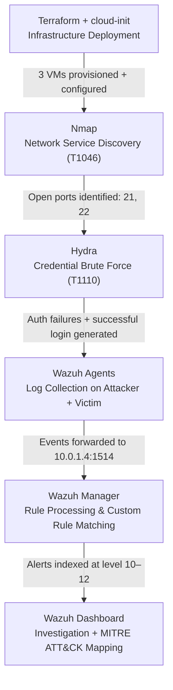

# Azure Cloud SOC Home Lab

> This is a cloud-based Security Operations Center home lab built from scratch in Microsoft Azure as a hands-on platform for practicing threat detection, SIEM administration, and attack simulation.

---

### Ethical and Legal Disclaimer
> [!IMPORTANT]
> The following project covers tools and methodologies that are for authorized, ethical use in controlled lab environments ONLY. I do NOT condone the usage of such tools and methods for malicious or unethical purposes. Follow ALL applicable international and local laws accordingly. I am not liable for any damage done fully or in part from the information covered in this project writeup. The below information is for educational purposes only. All attack simulations were conducted exclusively against infrastructure I own and control.

## Table of Contents

- [Motivation](#motivation)
- [Environment](#environment)
- [Infrastructure & Automation](#infrastructure--automation)
- [Toolset](#toolset)
- [Methodology](#methodology)
- [Skills Gained](#skills-gained)
- [Screenshots](#screenshots)

---

## Motivation

I wanted to build a hands-on SOC environment to develop practical blue team skills beyond what certifications and theory alone can offer. Rather than using a local VM setup, I deployed this lab entirely in Microsoft Azure to gain real experience working with cloud infrastructure while simultaneously learning SIEM administration and detection engineering.

The project was designed around a realistic attack-and-detect scenario: a dedicated attacker machine runs live credential attacks and network reconnaissance against an intentionally misconfigured target, while a central SIEM ingests logs from both machines and surfaces the activity as mapped alerts. Every component was deployed through Infrastructure as Code so the environment is fully reproducible, teardown is instantaneous, and the code itself doubles as a portfolio artifact demonstrating IaC skills alongside the security work.

---

## Environment

| Component | Details |
|-----------|---------|
| **Cloud** | Microsoft Azure — East US region |
| **Local OS** | Windows 11 |
| **IaC** | Terraform (azurerm provider ~> 4.0) |
| **SIEM** | Wazuh 4.14 (Manager + Indexer + Dashboard) |
| **SIEM Server** | Ubuntu 22.04 LTS — Standard_D4s_v3 (4 vCPU / 16 GB RAM) |
| **Attacker VM** | Ubuntu 22.04 LTS — Standard_D2s_v3 (2 vCPU / 8 GB RAM) |
| **Victim VM** | Ubuntu 22.04 LTS — Standard_D2s_v3 (2 vCPU / 8 GB RAM) |
| **Network** | Azure Virtual Network with 3 segmented subnets |
| **Access** | SSH key authentication (ed25519) + NSG IP restrictions |

---

## Infrastructure & Automation

All infrastructure was provisioned using Terraform with a modular layout — a root module calling separate child modules for networking, the SIEM, the attacker, and the victim. Each VM receives its full software configuration automatically at first boot via cloud-init, meaning `terraform apply` produces a fully operational three-VM SOC environment with zero manual server configuration.

Key design decisions:

- **Network segmentation** — three dedicated Azure subnets (SOC / attacker / victim) each with their own Network Security Group enforcing least-privilege traffic rules. Attack traffic flows only from the attacker subnet to the victim subnet; Wazuh agent traffic flows from both agent VMs inward to the SOC subnet only
- **Static private IP for SIEM** — the SIEM is pinned to `10.0.1.4` so both agent cloud-init scripts can reference a known address at boot time, eliminating any dependency on Terraform output values
- **NSG home IP restriction** — SSH access and Wazuh Dashboard access (HTTPS port 443) are restricted to a single source IP, preventing the management interfaces from being exposed to the public internet
- **cloud-init automation** — the SIEM cloud-init runs the Wazuh 4.14 all-in-one quickstart script; the attacker cloud-init installs Hydra, Nmap, and the Wazuh agent; the victim cloud-init installs vsftpd with intentionally weak credentials, enables SSH password authentication, and enrolls the Wazuh agent
- **Auto-shutdown schedules** — all three VMs are configured via `azurerm_dev_test_global_vm_shutdown_schedule` to shut down nightly at 2 AM UTC, eliminating idle compute costs without requiring manual intervention

**Wazuh Dashboard** is accessed through HTTPS on port 443 directly from the Windows 11 workstation. The stack uses Wazuh's bundled OpenSearch-based indexer and OpenSearch Dashboards-based frontend rather than a standalone ELK deployment — all three components are installed by the Wazuh quickstart installer in a single automated step.

---

## Toolset

| Tool | Category | Purpose |
|------|----------|---------|
| **Terraform** | Infrastructure as Code | Declarative provisioning of all Azure resources across modular configuration files |
| **cloud-init** | Automation | First-boot VM configuration — installs and configures all software without manual SSH |
| **Wazuh Manager** | SIEM | Central log processing engine; parses agent events, runs rules, generates alerts |
| **Wazuh Indexer** | Log Storage | OpenSearch-based backend that indexes and stores all alerts for querying |
| **Wazuh Dashboard** | Visualization | OpenSearch Dashboards-based UI for alert investigation, MITRE ATT&CK mapping, and custom dashboards |
| **Nmap** | Reconnaissance | Network service discovery and version fingerprinting against the victim VM |
| **Hydra** | Credential Attack | Automated FTP and SSH brute-force using dictionary wordlist (rockyou.txt) |
| **vsftpd** | Target Service | Intentionally misconfigured FTP server on the victim VM — primary brute-force target |
| **Azure NSG** | Network Control | Stateful traffic rules enforcing subnet isolation and restricting management access |

---

## Methodology

The lab runs in three sequential phases that mirror a real-world attack-and-detect workflow:

**Phase 1 — Infrastructure Deployment** provisions the full environment from a single `terraform apply` command. Terraform creates the resource group, virtual network, three subnets, NSGs, public IPs, and all three VMs in the correct dependency order. cloud-init handles the rest — Wazuh installs on the SIEM, attack tools install on the attacker, and vsftpd with a weak credential set installs on the victim. After approximately 20 minutes of automated first-boot configuration, the Wazuh Dashboard is accessible and both agents appear as active.

**Phase 2 — Attack Simulation** runs entirely from the attacker VM. An Nmap service version scan maps the victim's open ports and identifies the running services (vsftpd on port 21, OpenSSH on port 22). Hydra then executes a dictionary attack against the FTP service using a targeted slice of rockyou.txt, generating a sustained stream of authentication failures before finding the correct credential. Because the attacker VM also runs a Wazuh agent, process execution telemetry from the attack tools is captured alongside the victim's authentication failure logs — giving the SIEM dual-perspective visibility into the same event.

**Phase 3 — Detection & Investigation** is conducted from the Wazuh Dashboard on the Windows 11 workstation. Custom XML detection rules (rule IDs 100001–100003) fire on the authentication failure patterns and escalate them to severity level 12 with MITRE ATT&CK technique tags (T1046, T1110, T1110.001, T1110.003). The events view shows the full alert timeline, the MITRE ATT&CK Framework view maps the techniques to their tactics, and a custom dashboard built on the `wazuh-alerts-*` index visualizes alert volume by rule description and source IP over time.

---

## Skills Gained

**Infrastructure as Code** — Building the lab entirely in Terraform exposed me to the practical realities of IaC: modular design patterns, managing resource dependencies across modules, handling state after partial deployment failures, and using `terraform plan` as a safety gate before every apply. The experience of debugging a real deployment failure (wrong resource name in a module, missing password on a VM with `disable_password_authentication = false`) and resolving it without destroying already-provisioned resources demonstrated exactly how Terraform's state model works in practice, not just in theory.

**Cloud network security** — Designing the NSG ruleset from scratch required thinking carefully about the minimum necessary traffic flows for each subnet. The SOC subnet only accepts inbound traffic on ports 22, 443, 1514, and 1515 from controlled sources. The victim subnet accepts all traffic from the attacker subnet (by design) but is fully blocked from the internet. Working through the Azure quota system — discovering that B-series VMs weren't available on my subscription and identifying equivalent D-series alternatives — gave me practical familiarity with how cloud subscription limits work and how to query them before deployment.

**SIEM deployment and administration** — Standing up Wazuh 4.14 from scratch, enrolling agents across multiple VMs, diagnosing why an agent showed as disconnected, and manually registering agents via `agent-auth` all gave me operational experience that reading documentation alone doesn't provide. Understanding that the Wazuh Indexer is an OpenSearch fork, that the dashboard runs on port 443 rather than the 5601 I expected from a traditional ELK setup, and that the all-in-one installer manages the entire stack as a unit deepened my understanding of how modern SIEM products are packaged.

**Detection engineering** — Writing custom Wazuh rules in XML taught me the parent-child rule model: how to reference a parent rule's ID with `if_matched_sid`, how `frequency` and `timeframe` work together to create composite detection logic, and how `same_source_ip` prevents multiple different hosts from falsely triggering a brute-force rule. Attaching MITRE ATT&CK technique IDs via the `<mitre>` tag and validating rules with `wazuh-logtest` before deployment showed me how detection rules connect to a broader threat intelligence framework rather than existing as isolated signatures.

**Attack simulation and offensive awareness** — Running Nmap and Hydra against a live target gave me a defender's intuition about what attacks actually look like in logs. Seeing that a single Hydra FTP session against a 4-thread limit generates hundreds of individual PAM authentication failure events in under two minutes helped me understand why frequency-based detection rules need tight timeframes to be actionable. Understanding why Hashcat isn't the right tool for attacking a live service (it cracks hashes offline, not live authentication endpoints) reinforced the conceptual distinctions between different classes of credential attacks.

---

## Screenshots

### Wazuh Dashboard — Home

> *[SCREENSHOT: Wazuh_home.png]*

Both Wazuh agents — `attacker-vm` and `victim-vm` — showing as active, with 1 high severity alert, 502 medium severity alerts, and 1,675 low severity alerts generated during the attack simulation window.

---

### Phase 1 — Infrastructure Deployment

The Wazuh home screen confirms that both agents enrolled successfully after `terraform apply` completed and cloud-init finished running on all three VMs. The Agents Summary ring shows Active (2) / Disconnected (0).

> *[SCREENSHOT: Wazuh_home.png]*

---

### Phase 2 — Attack Simulation: Nmap Service Scan (T1046)

> *[SCREENSHOT: Nmap_scan.png]*

Two Nmap commands run against the victim (`10.0.2.4`): a service version scan (`-sV -T4`) identifying vsftpd 3.0.5 on port 21 and OpenSSH 8.9p1 on port 22, followed by a full port scan (`-p-`) confirming only those two ports are open across all 65535.

---

### Phase 2 — Attack Simulation: Hydra FTP Brute Force (T1110)

> *[SCREENSHOT: Hydra_brute_force.png]*

Hydra targeting `ftp://10.0.2.4` with user `ftpuser` and a 201-entry wordlist slice from rockyou.txt. The successful credential hit (`ftpuser:Password123`) is confirmed at line `[21][ftp] host: 10.0.2.4 login: ftpuser password: Password123`.

---

### Phase 3 — Detection: Wazuh Default Dashboard

> *[SCREENSHOT: Wazuh_default_dashboard.png]*

The Threat Hunting dashboard filtered to `agent.name: victim-vm`, `rule.level: 12 to 14`, showing 1 level-12 alert generated during the attack window. The Top 10 MITRE ATT&CKs donut chart shows Brute Force and Valid Accounts as the triggered technique categories.

---

### Phase 3 — Detection: Events View

> *[SCREENSHOT: wazuh_events_view.png]*

The MITRE ATT&CK events view filtered to the attack timeframe showing 147 hits. Visible alert types include rule 40112 (multiple authentication failures followed by success, T1078 + T1110, level 12), rule 11452 (vsftpd multiple FTP connection attempts, T1110, level 10), and rule 5503 (PAM user login failed, T1110.001, level 5) — all sourced from `victim-vm`.

---

### Phase 3 — Detection: MITRE ATT&CK Dashboard

> *[SCREENSHOT: Wazuh_mitre_attack_dashboard.png]*

The MITRE ATT&CK Dashboard showing the full attack session across four panels: alert evolution over time (spike at 21:35 during the Hydra run), attacks by technique (Credential Access dominant), top tactics by agent, and MITRE techniques broken out per agent — all attributed to `victim-vm`.

---

### Phase 3 — Detection: MITRE ATT&CK Framework — T1110.001 Drill-Down

> *[SCREENSHOT: wazuh_mitre_attack_ttps.png]*

The Framework tab showing Credential Access with 147 events, T1110.001 (Password Guessing) as the primary technique with 112 hits. The event table confirms individual events mapped to `victim-vm` agent with rule ID 5503 (PAM: User login failed) at level 5.

---

### Phase 3 — Detection: Custom Dashboard

> *[SCREENSHOT: wazuh_custom_dashboard.png]*

A custom Wazuh Dashboard built on the `wazuh-alerts-*` index showing alert volume by rule description split by source IP (`10.0.3.4` — the attacker). Visible alert categories include vsftpd login failures, PAM multiple failed logins, vsftpd FTP brute force, and vsftpd multiple FTP connection attempts — all generated during the Hydra session.
